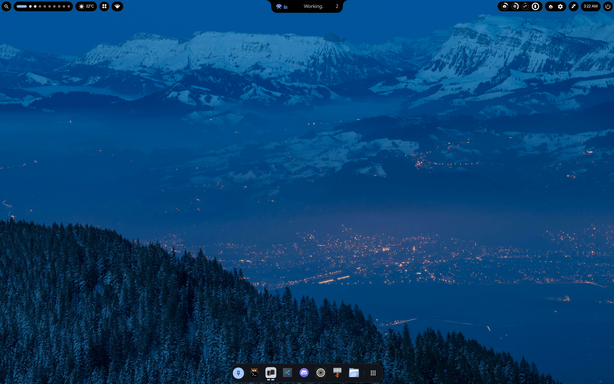
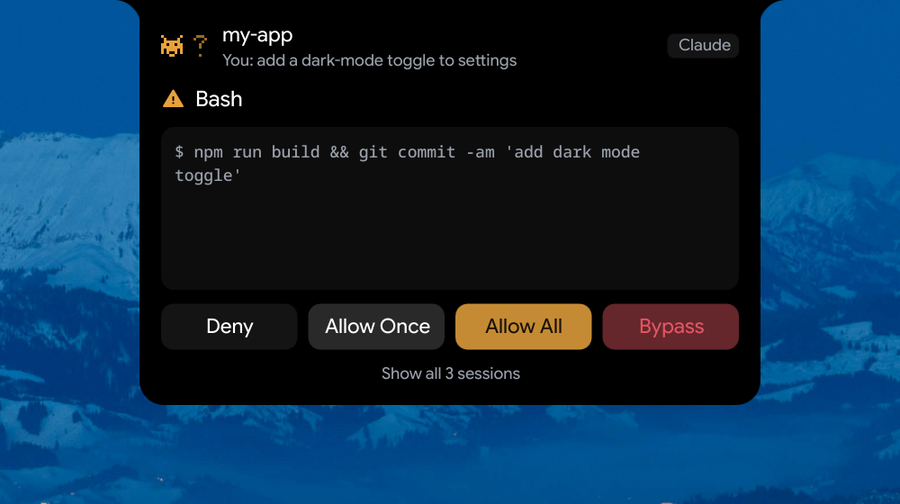
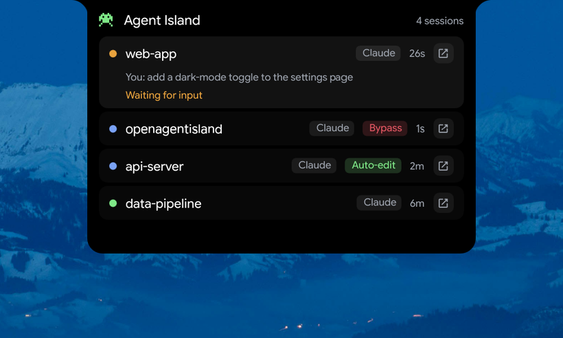
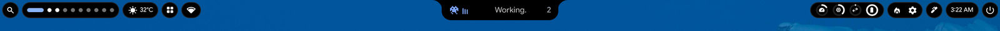
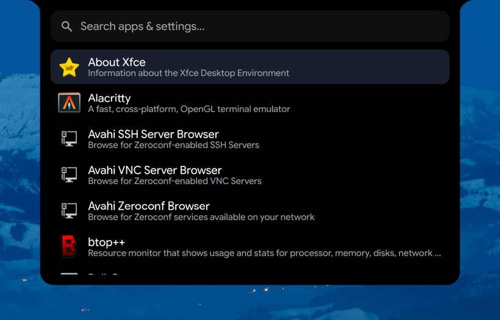
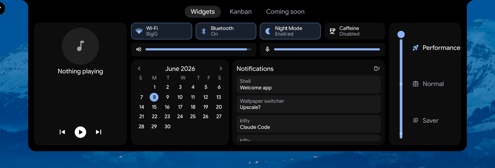
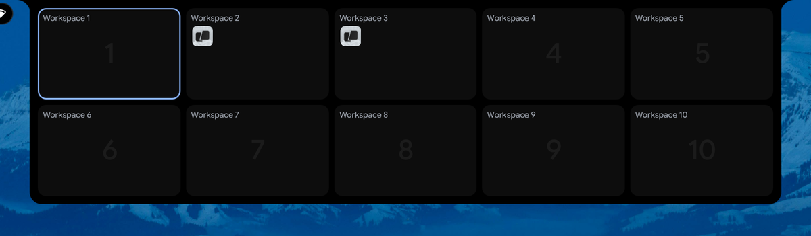

<h1 align="center">OpenAgentIsland</h1>

<p align="center"><b>A macOS-style Dynamic Island desktop for Hyprland — that puts your Claude Code agents right in the notch.</b></p>

<p align="center">Built in <a href="https://quickshell.outfoxxed.me/">Quickshell</a>/QML on top of the <a href="https://github.com/end-4/dots-hyprland">end-4 / illogical-impulse</a> framework.</p>

<p align="center"></p>

No full-width bar — **three floating islands** with the wallpaper breathing through the gaps. The
centerpiece is a **morphing notch**: a minimal clock when idle that fluidly expands for volume,
brightness, media, notifications, dashboards… and the headline act:

> **Live Claude Code agent status, with permission Allow / Deny right from the notch.**

---

## ✨ The headline: Claude Code, in your notch

When a Claude Code session wants to run a command or edit a file, the request **comes to you** — the
notch morphs open with the tool, a preview of exactly what it'll do, and four one-tap choices:
**Deny · Allow Once · Allow All · Bypass**. Approve it without ever leaving what you're doing.

<table>
<tr>
<td width="55%"></td>
<td width="45%"></td>
</tr>
<tr>
<td align="center"><i>Approve / deny a tool call from the notch</i></td>
<td align="center"><i>Every session at a glance</i></td>
</tr>
</table>

- 🔔 **Permission from the notch** — `Bash` / `Write` / `Edit` requests surface as a card with a live
  preview. Allow once, allow-all-this-tool, or bypass the whole session.
- 🧑‍🤝‍🧑 **Multi-session** — track every running `claude` at once: status, the prompt you gave it, and a
  live relative time. Sorted by urgency (needs-you first).
- 🚀 **Jump to terminal** — click a session to focus the terminal running it, switching workspace if
  needed.
- 🏷️ **Live mode chips** — each session shows its permission mode (**Auto-edit**, **Bypass**, **Plan**),
  synced live from the terminal and updated when you Shift+Tab.
- 🛟 **Safe by design** — the bridge is fire-and-forget; if the island isn't listening or anything goes
  wrong, the hook falls back to Claude Code's normal prompt. It can **never hang or break** your Claude
  Code. (13/13 safety checks: `python3 bridge/test_safety.py`.)

---

## 🏝️ Three floating islands

<p align="center"></p>

- **Left** — search · workspaces · weather · overview · network
- **Center (the notch)** — the morphing star (clock → OSDs → media → agent → surfaces)
- **Right** — resources · clock · battery · system tray · power

Fully **multi-monitor**: every island renders per-monitor in correct logical coordinates (scaled and
rotated displays included), and a surface opens only on the monitor you clicked.

---

## 🌀 The notch morphs

Click it — or let it react. Goey spring animations the whole way.

<table>
<tr>
<td></td>
<td></td>
</tr>
<tr>
<td align="center"><i>Volume / brightness OSD</i></td>
<td align="center"><i>Fuzzy app &amp; settings launcher</i></td>
</tr>
<tr>
<td></td>
<td></td>
</tr>
<tr>
<td align="center"><i>Dashboard — toggles, media, calendar, notifications</i></td>
<td align="center"><i>Workspace overview (drag windows between workspaces)</i></td>
</tr>
</table>

…plus media with an audio visualizer, brightness, notifications, a power menu, and screen-capture tools.

---

## What's actually new here

The desktop chrome (islands, OSDs, overview, dashboard, launcher) builds on end-4. The genuinely novel
part is the **agent bridge**:

- **`bridge/`** — Claude Code hooks → a Unix socket → the island. For permission events the hook blocks
  on the socket; your tap in the notch sends the decision back. Safety-first throughout.
- **The notch agent UI** — live status, the permission card, the session list, jump-to-terminal, and the
  live permission-mode chips.

---

## Requirements

- **Hyprland** with the **end-4 / illogical-impulse** setup (provides the Lua-based Hyprland config —
  `hl.dsp.*` dispatch — plus all packages, fonts, services, and the Quickshell framework). Arch-based
  (CachyOS, EndeavourOS, …) is the smoothest path.
- **Quickshell** ≥ 0.2.1 (installed by the end-4 setup).
- **Python 3** (standard library only) — for the agent bridge.
- **[Claude Code](https://claude.com/claude-code)** — for the agent feature (optional; the desktop works
  great without it).

---

## Install (set it up exactly like the screenshots)

### 1. Install the end-4 base first
Follow <https://github.com/end-4/dots-hyprland>. This sets up Hyprland (with the Lua config), Quickshell,
and every dependency. Make sure that desktop boots and works before continuing.

### 2. Clone OpenAgentIsland into your Quickshell configs
```sh
git clone https://github.com/patheonsceo/Dynamic-island-for-arch.git ~/Projects/openagentisland
ln -s ~/Projects/openagentisland/quickshell ~/.config/quickshell/openagentisland
```
Quickshell only loads configs from `~/.config/quickshell/<name>/`, so the symlink points the
`openagentisland` config at the repo. (You can also clone straight into `~/.config/quickshell/openagentisland`.)

### 3. Switch your desktop to it
end-4 picks the Quickshell config from `~/.config/hypr/hyprland/variables.lua`:
```lua
hl.env("qsConfig", "ii")              -- before
hl.env("qsConfig", "openagentisland") -- after
```
Then relogin, or hot-swap without one:
```sh
pkill -f "qs -c ii"; hyprctl dispatch exec "qs -c openagentisland"
```
You'll see the three floating islands. To go back, set `qsConfig` to `"ii"`.

### 4. (Optional) Enable the Claude Code agent feature
With Claude Code installed:
```sh
python3 ~/Projects/openagentisland/bridge/install-hooks.py enable
```
This merges **only** the OpenAgentIsland hooks into `~/.claude/settings.json` (backing it up first) and
auto-resolves paths. Start a `claude` session and watch the notch.

- Disable: `python3 bridge/install-hooks.py disable` · Status: `… status`
- Prove the safety net (no island required): `python3 bridge/test_safety.py`

---

## Notes & gotchas

- **Multi-monitor / scaled / rotated displays** — handled; each island renders per-monitor in *logical*
  coordinates, surfaces open only on the monitor you clicked.
- **Lua-Hyprland dispatch** — this config uses the `hl.dsp.*` Lua dispatch API (the plain
  `dispatch "focuswindow …"` form silently no-ops on a Lua-config Hyprland).
- **Single-process terminals (e.g. Warp)** — all windows share one PID, so jump-to-terminal matches the
  right *window* by title; it can't switch internal tabs.
- **Design / architecture** lives in `NOTES.md`; the running work log is in `PROGRESS.md`.

---

## Credits & license

- Built on **[end-4 / dots-hyprland (illogical-impulse)](https://github.com/end-4/dots-hyprland)** — GPL-3.0.
- Built with **[Quickshell](https://quickshell.outfoxxed.me/)**.
- Notch interaction techniques studied from **[Hyprfabricated](https://github.com/tr1xem/hyprfabricated)**
  (technique only — re-implemented in Quickshell/QML, no code copied).

A derivative work of end-4, released under the **GNU General Public License v3.0** — see
[`LICENSE`](./LICENSE). If you distribute it or a modified version, it must remain GPL-3.0, keep these
notices, and provide source.
